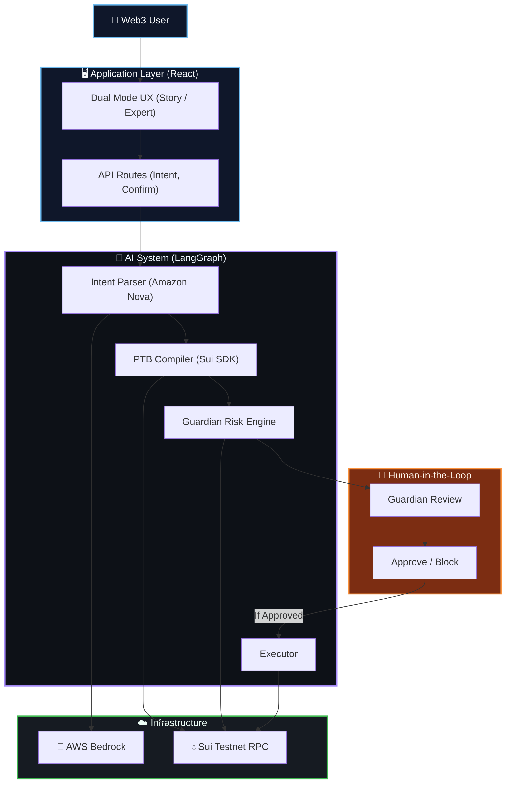

<div align="center">
  
  <h1>🛡️ SuiGuard</h1>
  <p><strong>Intelligent AI Intent Engine & Pre-Flight Guardian for the Sui Network</strong></p>
  <p><i>An AI-powered operating system for Web3 that safely parses plain English goals, compiles them into raw Sui Programmable Transaction Blocks, and performs deep risk analysis before execution.</i></p>
  
  [](https://sui.io/)
  [](https://langchain-ai.github.io/langgraph/)
  [](https://aws.amazon.com/bedrock/)
  []()
  
</div>

---

## 📖 The Problem — Why This Exists

Imagine you are a first-time DeFi user trying to execute a trade. Today's Web3 wallets force you to accept default slippage parameters, sign opaque hex blobs you don't understand, and blindly trust that the decentralized exchange routing your trade isn't utilizing stale oracle data. 

**By the time a user realizes they've suffered from severe price impact or interacted with a malicious contract, their capital is already gone.**

> **The Critical Gap:** No existing Web3 wallet combines natural language intent parsing with deep, pre-flight statistical risk modelling. SuiGuard unifies these capabilities into an AI-orchestrated system that runs continuously, surfacing critical dangers (like high slippage or unverified recipients) in plain English before a single byte touches the blockchain.

---

## ✨ What SuiGuard Does — Solution Overview

SuiGuard is an **Agentic Web Application** that acts as an active participant in your Web3 transaction lifecycle. It replaces complex decentralized application (dApp) interfaces and manual wallet interactions with a unified, natural language **Intent Engine**.

Instead of manually calculating slippage, finding liquidity pools, and formatting raw transactions, users simply type what they want to do:
> *"Swap 10 SUI for USDC"* or *"Send 5 SUI to 0x123..."*

### 1. Ingests Intent (Powered by Amazon Nova)
Powered by AWS Bedrock's **Amazon Nova**, our LangGraph agent extracts complex financial goals from unstructured natural language and maps them perfectly to Sui actions.

### 2. Compiles Payload (Sui TypeScript SDK)
Translates AI intents directly into native `@mysten/sui` Programmable Transaction Blocks (PTBs). It dynamically splits coins, calculates network fees, and prepares safe module routes automatically.

### 3. Detects Risk (Pre-Flight Guardian Simulator)
Before presenting the compiled PTB to the user, SuiGuard runs it through a 5-tier safety simulator to catch catastrophic risks:
* **High Slippage:** Simulates pool depth to block trades with >5% price impact.
* **Stale Oracles:** Verifies Sui Network epoch timestamps to prevent trading on stale price data.
* **Balance Overreach:** Prevents transactions that would leave the user without gas for future actions.
* **Large Transaction Warnings:** Flags oversized market orders to prevent sandwich attacks.
* **Address Verification:** Cross-checks recipient addresses against on-chain transaction history.

### 4. Synthesizes & Explains (Dual Mode UX)
The platform features an interactive toggle separating beginner usability from expert transparency:
* **Story Mode:** Focuses on "You Give", "You Get", and clear text (No mention of PTBs or Liquidity Pools).
* **Expert Mode:** Exposes the raw execution context and a syntax-highlighted `Serialized_TransactionBlock.json`.

### 5. Verifiable AI Trace
Transparency is critical in Agentic Web applications. SuiGuard includes a built-in **Live Backend Trace Terminal**. Users and judges can expand a terminal UI to watch the AI's internal monologue, see the exact JSON schemas extracted, and view the Guardian score logs live. Every metric is securely logged to LangSmith.

---

## 🧠 Core System Architecture

The **SuiGuard** platform is designed as a highly cohesive, concurrently executing web application built for the Sui Overflow hackathon.



---

## 🚀 Quick Start Guide (Run Locally)

Want to run SuiGuard on your own machine? It's incredibly easy.

### Prerequisites
- Node.js (v18 or higher)
- npm or yarn
- An AWS Account with Bedrock Amazon Nova model access
- A LangSmith account (for tracing)

### 1. Clone the Repository
```bash
git clone https://github.com/adarshcod30/SuiGuard.git
cd SuiGuard
```

### 2. Setup the Backend
```bash
cd backend
npm install
```
Create a `.env` file in the `backend/` directory:
```env
# AWS Bedrock credentials (Amazon Nova models)
AWS_ACCESS_KEY_ID=your_aws_access_key
AWS_SECRET_ACCESS_KEY=your_aws_secret_key
AWS_REGION=us-east-1

# LangSmith Tracing
LANGCHAIN_TRACING_V2=true
LANGCHAIN_API_KEY=your_langchain_api_key
LANGCHAIN_PROJECT=suiguard-intent-engine

# Network (testnet or mainnet)
SUI_NETWORK=testnet
PORT=3001
```

### 3. Setup Wallet (Auto-generates + Funds)
```bash
npm run setup-wallet
```
This will automatically generate a Sui Keypair, write the private key to your `.env`, and request free Testnet SUI from the faucet!

### 4. Setup the Frontend
Open a new terminal window:
```bash
cd frontend
npm install
```
Create a `.env` file in the `frontend/` directory (Optional if running locally):
```env
VITE_API_URL=http://localhost:3001
```

### 5. Run the Stack
```bash
# Terminal 1 — Backend
cd backend
npm run dev

# Terminal 2 — Frontend
cd frontend
npm run dev
```
Navigate to `http://localhost:5173` in your browser.

---

## 🤝 Contributing

Contributions are always welcome! 
1. Fork the project.
2. Create your feature branch (`git checkout -b feature/AmazingFeature`).
3. Commit your changes (`git commit -m 'Add some AmazingFeature'`).
4. Push to the branch (`git push origin feature/AmazingFeature`).
5. Open a Pull Request.

---

<div align="center">
  <p>Built with ❤️ for <strong>Sui Overflow 2026</strong></p>
</div>
