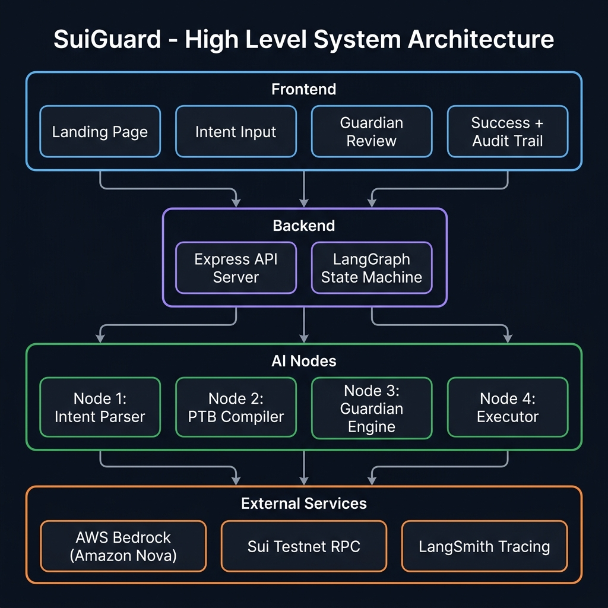
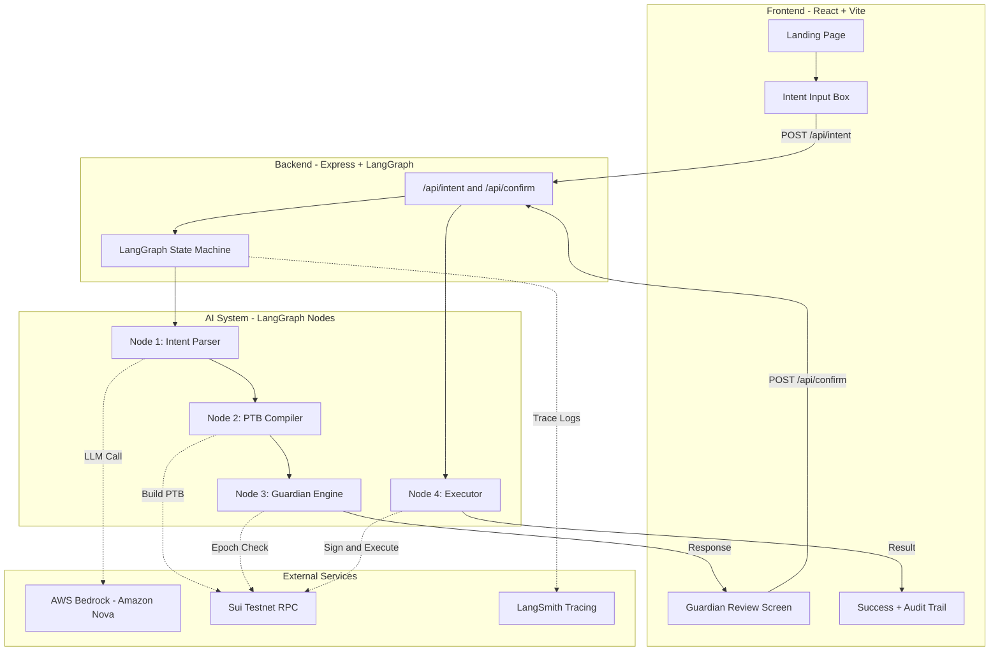
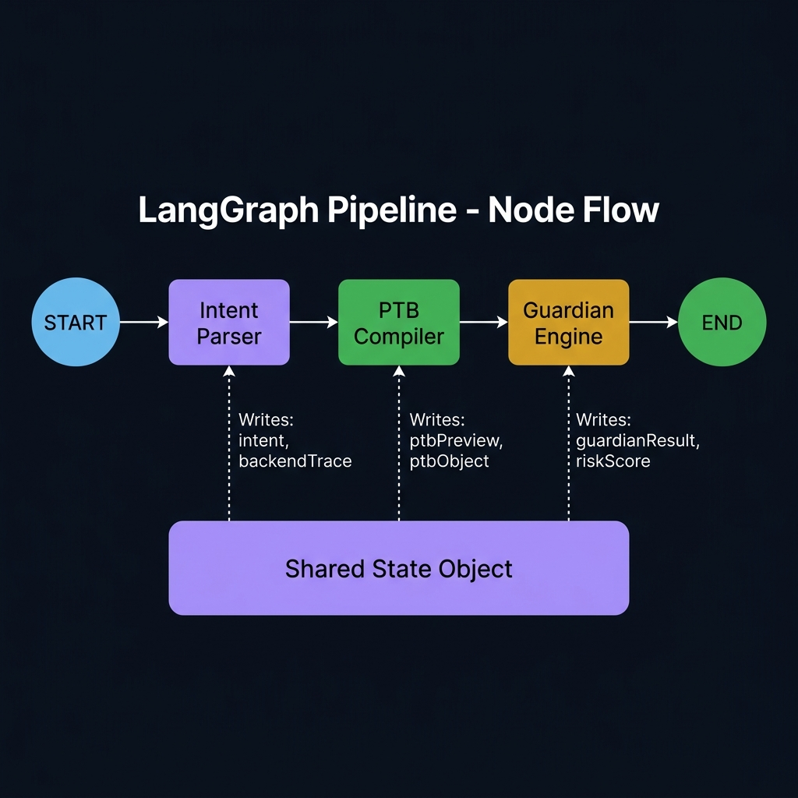
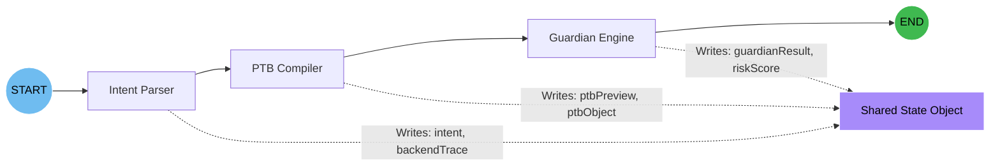
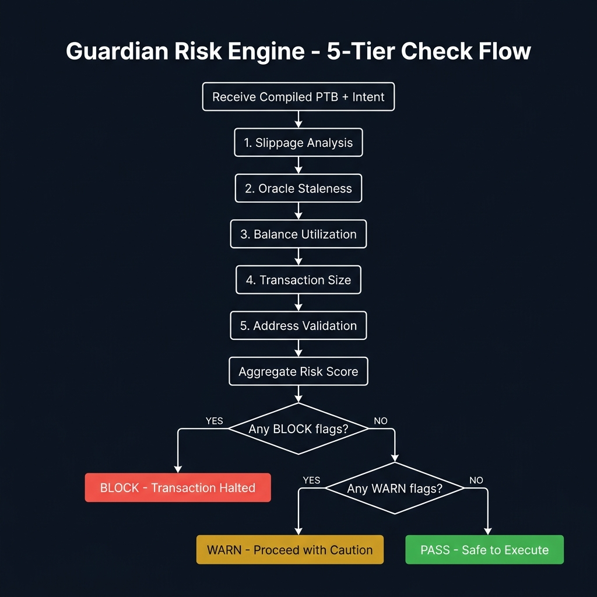
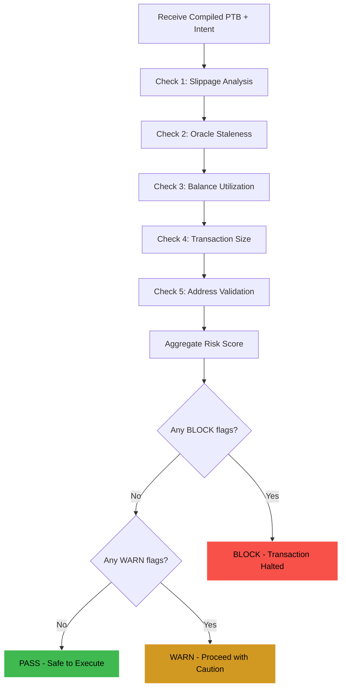
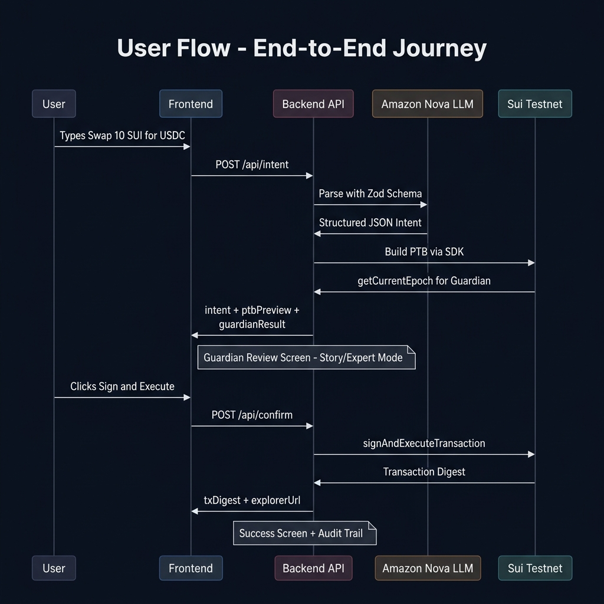
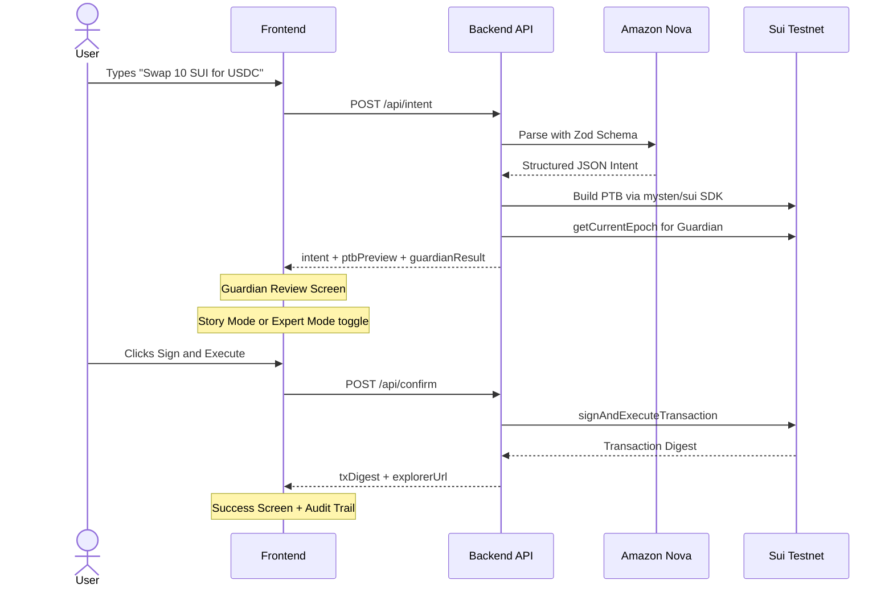
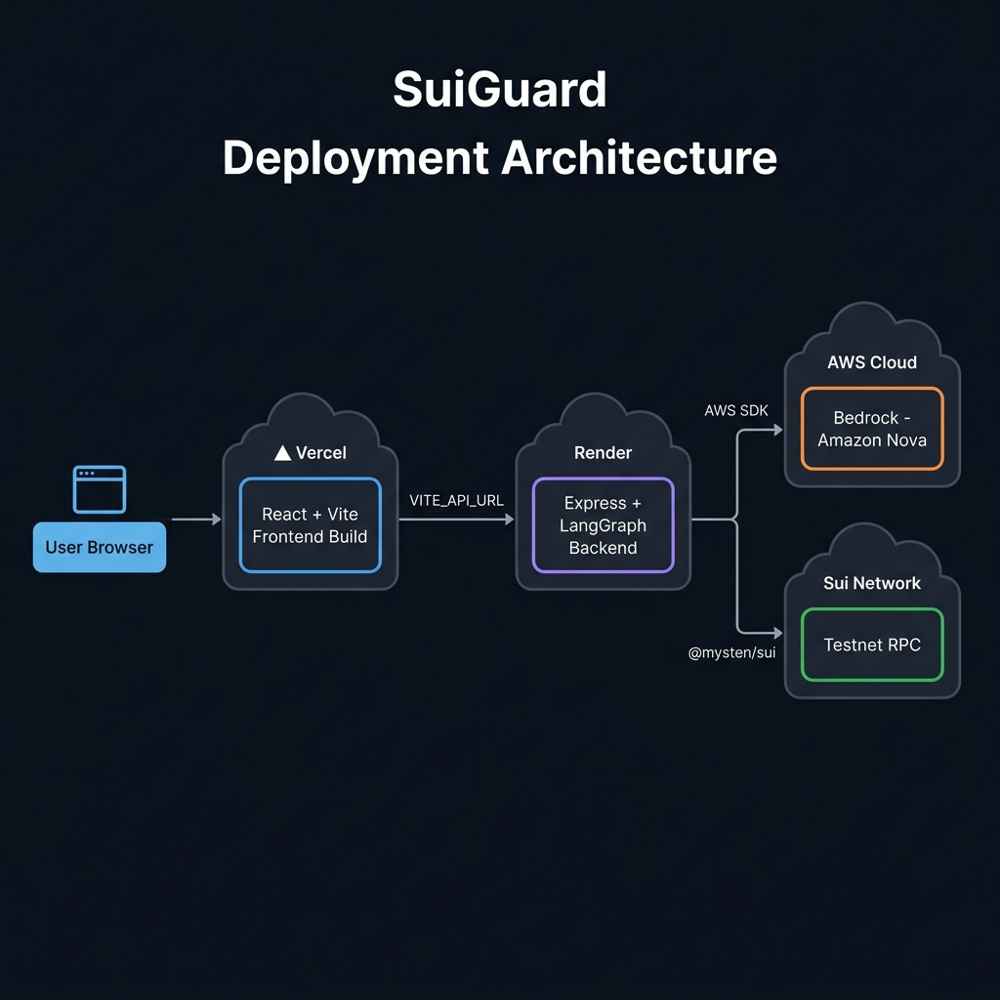
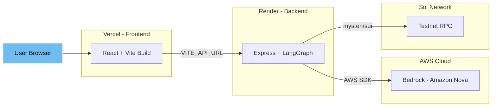

<div align="center">
  
  <h1>🛡️ SuiGuard</h1>
  <p><strong>The Brain Of Web3 Intents</strong></p>
  <p><i>An AI-powered operating system for Web3 that safely parses plain English goals, compiles them into raw Sui Programmable Transaction Blocks, and performs deep risk analysis before execution.</i></p>

  <br />

  [](https://www.typescriptlang.org/)
  [](https://sui.io/)
  [](https://react.dev/)
  [](https://aws.amazon.com/bedrock/)
  [](https://langchain-ai.github.io/langgraphjs/)
</div>

---

<br />

> 📸 **Dual Mode Guardian Review:** The system abstracts jargon for beginners while preserving deep payload verification for experts.

## Table of Contents

- [The Problem — Why This Exists](#the-problem--why-this-exists)
- [What SuiGuard Does — Solution Overview](#what-suiguard-does--solution-overview)
- [Key Features — Full Feature List](#key-features--full-feature-list)
- [Architecture — Full System Architecture](#architecture--full-system-architecture)
- [The Dual Mode UX](#the-dual-mode-ux)
- [The Audit Trail](#the-audit-trail--verifiable-execution-log)
- [Technology Deep Dive](#technology-deep-dive)
- [Setup & Installation](#setup--installation)
- [Deployment Guide](#deployment-guide)
- [Project Structure](#project-structure)
- [How It Works — Step by Step](#how-it-works--step-by-step)
- [Troubleshooting](#troubleshooting)

---

## The Problem — Why This Exists

Imagine you are a first-time DeFi user in an emerging market trying to execute a trade. Today's Web3 wallets force you to accept default slippage parameters, sign opaque hex blobs you don't understand, and blindly trust that the decentralized exchange routing your trade isn't utilizing stale oracle data. 

**By the time a user realizes they've suffered from severe price impact or interacting with a malicious contract, their capital is already gone.**

The value loss is silent, continuous, and devastating. 

> **The Critical Gap:** No existing Web3 wallet combines natural language intent parsing with deep, pre-flight statistical risk modelling. SuiGuard unifies these capabilities into an AI-orchestrated system that runs continuously, surfacing critical dangers (like high slippage or unverified recipients) in plain English before a single byte touches the blockchain.

---

## What SuiGuard Does — Solution Overview

SuiGuard is an autonomous AI agent system. It is not just a UI wrapper; it is an active participant in your Web3 transaction lifecycle that reasons about what you want to achieve, generates the code to do it, and acts as a security firewall.

1. **Ingests Intent:** Parses ambiguous natural language like "Swap 5 SUI for USDC" via Amazon Nova (AWS Bedrock).
2. **Compiles Payload:** Constructs a true Sui Programmable Transaction Block (PTB), linking multiple on-chain operations atomically.
3. **Detects Risk:** Simulates the PTB against 5 rigorous checks (Slippage, Balance, Oracle Staleness, Transaction Size, Address Validity).
4. **Synthesizes & Explains:** Translates complex technical risks into a human-readable "Story Mode" (Traffic lights, "You Give -> You Get").
5. **Requires Human Approval:** Halts the pipeline completely, demanding the user click "Sign & Execute" only after reviewing the Guardian flags.
6. **Maintains Transparency:** Provides an "Expert Mode" where crypto-natives can inspect the raw serialized JSON PTB payload before signing.
7. **Generates Audit Trail:** After execution, a complete timeline of every pipeline step is rendered — from LLM invocation to on-chain confirmation — so judges and users can verify exactly what happened.

---

## Key Features — Full Feature List

### 1. 3-Node LangGraph.js Pipeline
The core of SuiGuard is a stateful multi-agent pipeline: `Parser → Compiler → Guardian`. Each node has a single, testable responsibility. LangGraph.js manages a persistent, typed state object that flows through every node. A `skipOnError` wrapper ensures fault tolerance — if one node errors, downstream nodes gracefully pass through without crashing the graph.

### 2. Amazon Nova Reasoning (AWS Bedrock)
The system leverages Amazon Nova Lite, Micro, and Pro models as a cascading fallback chain. If the primary model fails, it automatically tries the next one. The LLM extracts structured intent data (Action, Amount, Token In, Token Out, Recipient) from unstructured, messy user input using Zod schema validation.

### 3. Native Sui PTB Compilation
Unlike Ethereum "intents" which rely on centralized solvers or off-chain promises, SuiGuard compiles actual **Sui Programmable Transaction Blocks** using the official `@mysten/sui` TypeScript SDK. The Guardian analyzes the exact payload that will be signed, guaranteeing zero deviation between the preview and the execution.

Supported actions:
- **Transfer:** Split coins from gas, transfer to recipient address
- **Swap:** Route through Cetus testnet AMM router with `MoveCall`
- **Balance Query:** Read-only operation, no transaction required
- **Stake:** Experimental support for validator staking

### 4. 5-Layer Guardian Risk Engine
Uses statistical boundaries and on-chain data to detect:

| Check | What It Does | Threshold |
|-------|-------------|-----------|
| **Slippage** | Simulates pool depth vs trade size | Blocks at >5%, warns at >1% |
| **Oracle Staleness** | Checks Sui epoch timestamp freshness | Blocks at >15 min, warns at >5 min |
| **Balance Utilization** | Prevents draining your wallet | Blocks if insufficient, warns at >80% |
| **Transaction Size** | Flags oversized market orders | Warns at >100 SUI |
| **Address Validity** | Verifies recipient exists on-chain | Warns if no history |

### 5. Dual Mode UX
The platform features an interactive toggle separating beginner usability from expert transparency:
* **Story Mode:** Focuses on "You Give", "You Get", and clear text (No mention of PTBs or Liquidity Pools). Risk checks displayed as simple traffic-light badges.
* **Expert Mode:** Exposes the raw execution context, a syntax-highlighted `Serialized_TransactionBlock.json`, a Guardian Risk Matrix table, and the live Backend Trace Terminal.

### 6. Audit Trail & Verifiable Execution Log
After every transaction, a comprehensive **Audit Trail** timeline is rendered showing:
- Intent parsing (which LLM model, what JSON was extracted)
- PTB compilation (which SDK commands were built)
- Guardian simulation (each risk check with pass/warn/block)
- Human approval step
- On-chain execution result with transaction digest

Each step is expandable to reveal raw internal data, making the entire pipeline fully transparent and verifiable.

### 7. Live Backend Trace Terminal
A built-in hacker-style terminal UI that shows the raw execution logs from the server in real-time with syntax highlighting:
- **Blue** = System logs (input received, model invocation)
- **Purple** = LLM output (extracted JSON schema)
- **Green** = PTB Compiler (SDK commands)
- **Yellow** = Guardian (simulation results)

### 8. LangSmith Integration
Every single LLM prompt, response, token count, and latency is logged to LangSmith for external verification. Users can click the "View AI Execution Trace" button to open the full trace on `smith.langchain.com`.

---

## High-Level System Architecture

<p align="center">
  
</p>

<details>
<summary>View as Mermaid (interactive)</summary>



</details>

---

## LangGraph Pipeline - Detailed Node Flow

<p align="center">
  
</p>

This is the internal state machine that powers the AI agent. Each node reads from and writes to a shared typed state object.

<details>
<summary>View as Mermaid (interactive)</summary>



</details>

> **Error Handling:** A `skipOnError` wrapper checks `state.stage === 'error'` before each node. If any node fails, all downstream nodes gracefully pass through without crashing the graph.

---

## Guardian Risk Engine - 5-Tier Check Flow

<p align="center">
  
</p>

<details>
<summary>View as Mermaid (interactive)</summary>



</details>

### Risk Scoring Formula

```
risk_score = (BLOCK_count x 40) + (WARN_count x 15)
```

| Check | Data Source | PASS | WARN | BLOCK |
|-------|-----------|------|------|-------|
| Slippage | `tradeValue / poolDepth` | Below 1% | 1-5% | Above 5% |
| Oracle | `suiClient.getCurrentEpoch()` | Below 5 min | 5-15 min | Above 15 min |
| Balance | `walletBalance - gasReserve` | Below 80% used | Above 80% used | Insufficient |
| Tx Size | `intent.amount` | Below 100 SUI | Above 100 SUI | N/A |
| Address | `suiClient.getOwnedObjects()` | Has history | No history | Invalid format |

---

## User Flow - End-to-End Journey

<p align="center">
  
</p>

<details>
<summary>View as Mermaid (interactive)</summary>



</details>

---

## Deployment Architecture

<p align="center">
  
</p>

<details>
<summary>View as Mermaid (interactive)</summary>



</details>

---

## The Dual Mode UX

SuiGuard features a **toggle switch** on the Guardian Review screen:

### Story Mode (For Beginners)
- Shows a clean "You Give / You Get" card with token icons
- Displays risk checks as simple colored badges
- Uses plain English explanations
- Hides all technical jargon (no PTBs, no JSON, no hex)

### Expert Mode (For Developers and Judges)
- Shows the raw extracted intent JSON from the LLM
- Displays the full serialized PTB payload with syntax highlighting
- Includes a Guardian Risk Matrix table with detailed threshold data
- Features a Live Backend Trace Terminal showing raw server logs
- Shows wallet address, gas budget, and guardian score

---

## The Audit Trail — Verifiable Execution Log

After clicking "Sign & Execute", the Success Screen renders a **complete Audit Trail timeline**:

```
📋 Audit Trail — Complete verifiable record of every pipeline step

🧠 Intent Parser          ✓ Done    17:23:04.123
   Parsed "swap 10 SUI for USDC" via Amazon Nova
   
🔨 PTB Compiler           ✓ Done    17:23:05.456
   Compiled 4 atomic commands into Programmable Transaction Block
   
🛡️ Guardian Engine        ✓ Done    17:23:06.789
   5-Tier Pre-Flight Simulation — Score: 15/100
   
👤 Human-in-the-Loop      ✓ Done    17:23:08.012
   User reviewed Guardian flags and approved execution
   
⚡ Executor               ✓ Done    17:23:09.345
   Transaction confirmed on Sui Testnet

✨ Pipeline complete — 5 nodes executed successfully
```

Each step is **expandable** — click any step to see the raw internal data (model name, extracted JSON, SDK commands, risk flag details, transaction digest).

---

## Technology Deep Dive

### Frontend Stack
| Technology | Purpose | Why |
|-----------|---------|-----|
| **React 18** | UI Framework | Component-based, fast virtual DOM |
| **Vite 5** | Build Tool | Near-instant HMR, optimized production builds |
| **TypeScript 5** | Type Safety | Catch errors at compile time, not runtime |
| **CSS (Custom)** | Styling | Glassmorphism, custom gradients, animations |

### Backend Stack
| Technology | Purpose | Why |
|-----------|---------|-----|
| **Express 4** | HTTP Server | Lightweight, battle-tested API framework |
| **LangGraph.js** | AI Orchestration | Stateful, multi-node agent pipelines |
| **@langchain/aws** | LLM Provider | Direct access to Amazon Nova via Bedrock |
| **@mysten/sui** | Blockchain SDK | Official Sui TypeScript SDK for PTB building |
| **Zod** | Schema Validation | Runtime type checking for LLM structured output |
| **LangSmith** | Observability | Trace every LLM call for debugging and verification |

### Infrastructure
| Service | Purpose |
|---------|---------|
| **Vercel** | Frontend deployment (React/Vite) |
| **Render** | Backend deployment (Node.js/Express) |
| **AWS Bedrock** | LLM inference (Amazon Nova models) |
| **Sui Testnet** | Blockchain RPC endpoint |

---

## Setup & Installation

### Prerequisites

Before you begin, make sure you have:

- **Node.js 18+** installed ([download](https://nodejs.org/))
- **npm** (comes with Node.js)
- **An AWS Account** with Bedrock access enabled for Amazon Nova models
  - Go to [AWS Bedrock Console](https://console.aws.amazon.com/bedrock/) → Model Access → Request access to Amazon Nova Lite, Micro, and Pro
  - Create IAM credentials (Access Key ID + Secret Access Key)
- **(Optional) A LangSmith Account** for AI tracing ([langsmith.com](https://smith.langchain.com/))

### 1. Clone the Repository

```bash
git clone https://github.com/adarshcod30/SuiGuard.git
cd SuiGuard
```

### 2. Setup the Backend

```bash
cd backend
npm install
```

Create a `.env` file in the `backend/` directory with the following variables:

```env
# AWS Bedrock credentials (Amazon Nova models)
# Get these from: AWS Console → IAM → Users → Security Credentials
AWS_ACCESS_KEY_ID=your_aws_access_key_id
AWS_SECRET_ACCESS_KEY=your_aws_secret_access_key
AWS_REGION=us-east-1

# LangSmith Tracing (optional but recommended)
# Get your API key from: https://smith.langchain.com/settings
LANGCHAIN_TRACING_V2=true
LANGCHAIN_API_KEY=your_langchain_api_key
LANGCHAIN_PROJECT=suiguard-intent-engine

# Sui Network Configuration
SUI_NETWORK=testnet
PORT=3001

# SUI_PRIVATE_KEY will be auto-generated on first run
```

### 3. Generate a Sui Wallet (Automatic)

```bash
npm run setup-wallet
```

This command will:
1. Generate a new Ed25519 keypair
2. Derive a Sui wallet address
3. Write the private key to your `.env` file automatically
4. Request free testnet SUI tokens from the faucet

You should see output like:
```
🔑 Generated new keypair. Address: 0xc58c2df253b130...
💧 Requesting testnet SUI...
✅ Faucet funded! Balance: 1.0000 SUI
```

### 4. Start the Backend

```bash
npm run dev
```

Expected output:
```
══════════════════════════════════════════════════════
  🛡️  SuiGuard Intent Engine — Backend
══════════════════════════════════════════════════════
  Wallet: 0xc58c2df253b130...
  Balance: 1.0000 SUI (testnet)
  LangSmith: suiguard-intent-engine
  Server: http://localhost:3001
══════════════════════════════════════════════════════
```

### 5. Setup the Frontend

Open a **new terminal window**:

```bash
cd frontend
npm install
```

Create a `.env` file in the `frontend/` directory (optional for local development):

```env
VITE_API_URL=http://localhost:3001
```

### 6. Start the Frontend

```bash
npm run dev
```

### 7. Open in Browser

Navigate to **[http://localhost:5173](http://localhost:5173)** and you're ready to go!

Try typing: `"What is my SUI balance?"` or `"Swap 0.5 SUI for USDC"`

---

## Deployment Guide

### Deploy Backend to Render (Free)

1. Create an account on [render.com](https://render.com/) and connect your GitHub.
2. Click **New +** → **Web Service** → select the `SuiGuard` repo.
3. Configure:
   - **Root Directory:** `backend`
   - **Build Command:** `npm install && npm run build`
   - **Start Command:** `npm start`
4. Add all environment variables from your `backend/.env`.
5. Select the **Free** instance type and deploy.
6. Copy the live URL (e.g., `https://suiguard-backend.onrender.com`).

### Deploy Frontend to Vercel (Free)

1. Create an account on [vercel.com](https://vercel.com/) and connect your GitHub.
2. Import the `SuiGuard` repo.
3. Set **Root Directory** to `frontend`.
4. Add environment variable: `VITE_API_URL` = your Render URL from above.
5. Deploy. Your app will be live at `https://sui-guard.vercel.app`.

---

## Project Structure

```
SuiGuard/
├── backend/
│   ├── src/
│   │   ├── index.ts          # Express API server (health, intent, confirm, wallet)
│   │   ├── graph.ts          # LangGraph state machine (Phase 1 & Phase 2)
│   │   ├── types.ts          # TypeScript interfaces (State, Risk, PTB)
│   │   ├── nodes/
│   │   │   ├── intentParser.ts  # Node 1: Amazon Nova LLM intent extraction
│   │   │   ├── ptbCompiler.ts   # Node 2: Sui PTB transaction builder
│   │   │   ├── guardian.ts      # Node 3: 5-tier risk analysis engine
│   │   │   └── executor.ts     # Node 4: On-chain transaction execution
│   │   └── sui/
│   │       ├── client.ts        # Sui RPC client configuration
│   │       └── wallet.ts        # Keypair management & faucet
│   ├── package.json
│   ├── tsconfig.json
│   └── .env                     # Environment variables (not committed)
│
├── frontend/
│   ├── src/
│   │   ├── App.tsx              # Main application router & state
│   │   ├── main.tsx             # React entry point
│   │   ├── index.css            # Global styles (glassmorphism, animations)
│   │   ├── vite-env.d.ts        # Vite TypeScript types
│   │   └── components/
│   │       ├── LandingPage.tsx      # Marketing landing page
│   │       ├── IntentInput.tsx      # Natural language input box
│   │       ├── LoadingState.tsx     # Processing animation
│   │       ├── GuardianReview.tsx   # Dual-mode review (Story/Expert)
│   │       ├── SuccessScreen.tsx    # Post-execution results
│   │       ├── AuditTrail.tsx       # Verifiable execution timeline
│   │       └── BackendTerminal.tsx  # Live server log terminal
│   ├── public/
│   │   └── favicon.svg          # Custom SVG favicon
│   ├── index.html
│   ├── package.json
│   ├── tsconfig.json
│   └── vite.config.ts
│
└── README.md
```

---

## How It Works — Step by Step

Here is exactly what happens when you type "Swap 10 SUI for USDC" and press Enter:

### Step 1: Intent Parsing (Node 1)
1. Your text is sent to `POST /api/intent` on the backend.
2. The backend invokes **Amazon Nova Lite** via AWS Bedrock's `ChatBedrockConverse` API.
3. A Zod schema constrains the LLM output to a structured JSON object:
   ```json
   {
     "action": "swap",
     "amount": 10,
     "token_in": "SUI",
     "token_out": "USDC",
     "recipient": null,
     "constraints": []
   }
   ```
4. If the primary model fails, the system cascades to Amazon Nova Micro, then Pro.

### Step 2: PTB Compilation (Node 2)
1. The structured intent is passed to the PTB Compiler.
2. A new `Transaction()` object is created using `@mysten/sui`.
3. For a swap: `tx.splitCoins()` separates the trade amount, then `tx.moveCall()` targets the Cetus testnet router.
4. A human-readable preview is generated (e.g., "① Approve 10 SUI for swap → ② Route through best pool → ③ Receive USDC").

### Step 3: Guardian Risk Analysis (Node 3)
1. **Slippage Check:** Calculates `tradeValueUSD / poolDepth * 100 * 2.5` to estimate price impact.
2. **Oracle Freshness:** Calls `suiClient.getCurrentEpoch()` and computes minutes since epoch start.
3. **Balance Check:** Ensures `amount < walletBalance - 0.01` (gas reserve).
4. **Transaction Size:** Flags if `amount > 100 SUI`.
5. **Address Check:** (transfers only) Calls `suiClient.getOwnedObjects()` to verify recipient exists.
6. Aggregates all flags into a risk score: `blocks * 40 + warns * 15`.

### Step 4: Guardian Review (Human-in-the-Loop)
1. The frontend displays the Guardian Review screen.
2. **Story Mode** shows "You Give → You Get" with colored risk badges.
3. **Expert Mode** shows raw JSON, serialized PTB, and the risk matrix.
4. User clicks "Sign & Execute" or "Cancel".

### Step 5: Execution (Node 4)
1. `POST /api/confirm` triggers Phase 2 of the LangGraph pipeline.
2. `suiClient.signAndExecuteTransaction()` signs the PTB with the server's keypair.
3. The transaction digest and Suiscan explorer URL are returned.

### Step 6: Audit Trail
1. The Success Screen renders a complete timeline of all 5 steps.
2. Each step is expandable to reveal raw data (model names, JSON schemas, risk scores, digests).
3. A LangSmith link provides external verification of the LLM trace.

---

## Troubleshooting

### "Backend Offline" in the header
- Make sure the backend is running (`cd backend && npm run dev`)
- If deployed, check that your `VITE_API_URL` environment variable points to the correct Render URL

### "All models failed to parse intent"
- Check your AWS credentials in `backend/.env`
- Verify Amazon Nova models are enabled in your [AWS Bedrock Console](https://console.aws.amazon.com/bedrock/)
- Make sure `AWS_REGION` is set to a region where Nova is available (e.g., `us-east-1`)

### "Insufficient balance" errors
- Run `npm run setup-wallet` in the backend directory to request testnet SUI
- Or visit the [Sui Testnet Faucet](https://faucet.testnet.sui.io/) manually

### Vercel build fails with TypeScript errors
- Run `cd frontend && npm run build` locally first to catch any errors
- Ensure `vite-env.d.ts` exists in `frontend/src/`

---

## 🤝 Contributing

Contributions are always welcome! 
1. Fork the project.
2. Create your feature branch (`git checkout -b feature/AmazingFeature`).
3. Commit your changes (`git commit -m 'Add some AmazingFeature'`).
4. Push to the branch (`git push origin feature/AmazingFeature`).
5. Open a Pull Request.

---

<div align="center">
  <p>Built with ❤️ for <strong>Sui Overflow 2026 · Agentic Web Track</strong></p>
  <p><sub>Powered by LangGraph + AWS Bedrock + Sui PTBs</sub></p>
</div>
