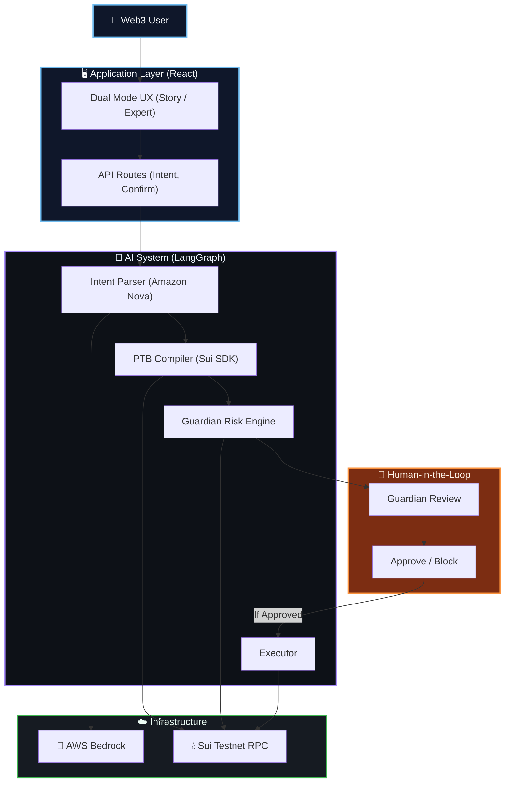

<div align="center">
  <h1>🛡️ SuiGuard</h1>
  <p><b>The Brain Of Web3 Intents</b></p>
  <p><i>An AI-powered operating system for Web3 that safely parses plain English goals, compiles them into raw Sui Programmable Transaction Blocks, and performs deep risk analysis before execution.</i></p>

  <br />

  [](https://www.typescriptlang.org/)
  [](https://sui.io/)
  [](https://react.dev/)
  [](https://aws.amazon.com/bedrock/)
  [](https://langchain-ai.github.io/langgraphjs/)
</div>

---

<br />

> 📸 **Dual Mode Guardian Review:** The system abstracts jargon for beginners while preserving deep payload verification for experts.

## Table of Contents

- [The Problem — Why This Exists](#the-problem--why-this-exists)
- [What SuiGuard Does — Solution Overview](#what-suiguard-does--solution-overview)
- [Key Features — Full Feature List](#key-features--full-feature-list)
- [Architecture — Full System Architecture](#architecture--full-system-architecture)
- [The Dual Mode UX](#the-dual-mode-ux)
- [Setup & Installation](#setup--installation)

---

## The Problem — Why This Exists

Imagine you are a first-time DeFi user in an emerging market trying to execute a trade. Today's Web3 wallets force you to accept default slippage parameters, sign opaque hex blobs you don't understand, and blindly trust that the decentralized exchange routing your trade isn't utilizing stale oracle data. 

**By the time a user realizes they've suffered from severe price impact or interacting with a malicious contract, their capital is already gone.**

The value loss is silent, continuous, and devastating. 

> **The Critical Gap:** No existing Web3 wallet combines natural language intent parsing with deep, pre-flight statistical risk modelling. SuiGuard unifies these capabilities into an AI-orchestrated system that runs continuously, surfacing critical dangers (like high slippage or unverified recipients) in plain English before a single byte touches the blockchain.

---

## What SuiGuard Does — Solution Overview

SuiGuard is an autonomous AI agent system. It is not just a UI wrapper; it is an active participant in your Web3 transaction lifecycle that reasons about what you want to achieve, generates the code to do it, and acts as a security firewall.

1. **Ingests Intent:** Parses ambiguous natural language like "Swap 5 SUI for USDC" via Amazon Nova (AWS Bedrock).
2. **Compiles Payload:** Constructs a true Sui Programmable Transaction Block (PTB), linking multiple on-chain operations atomically.
3. **Detects Risk:** Simulates the PTB against 5 rigorous checks (Slippage, Balance, Oracle Staleness, Transaction Size, Address Validity).
4. **Synthesizes & Explains:** Translates complex technical risks into a human-readable "Story Mode" (Traffic lights, "You Give -> You Get").
5. **Requires Human Approval:** Halts the pipeline completely, demanding the user click "Sign & Execute" only after reviewing the Guardian flags.
6. **Maintains Transparency:** Provides an "Expert Mode" where crypto-natives can inspect the raw serialized JSON PTB payload before signing.

---

## Key Features — Full Feature List

### 1. 3-Node LangGraph.js Pipeline
The core of SuiGuard is a stateful multi-agent pipeline: `Parser → Compiler → Guardian`. Each node has a single, testable responsibility. LangGraph.js manages a persistent, typed state object that flows through every node.

### 2. Amazon Nova Reasoning (AWS Bedrock)
The system leverages Amazon Nova Lite to reliably extract structured intent data (Action, Amount, Token In, Token Out, Recipient) from unstructured, messy user input.

### 3. Native Sui PTB Compilation
Unlike Ethereum "intents" which rely on centralized solvers or off-chain promises, SuiGuard compiles actual **Sui Programmable Transaction Blocks**. The Guardian analyzes the exact payload that will be signed, guaranteeing zero deviation between the preview and the execution.

### 4. 5-Layer Guardian Risk Engine
Uses statistical boundaries to detect:
* **High Slippage:** Detects if the trade amount is too large for the simulated pool depth.
* **Stale Oracles:** Detects if the liquidity pool hasn't synced within a safe time window.
* **Balance Overreach:** Prevents transactions that would leave the user without gas for future actions.

### 5. Dual Mode UX
The platform features an interactive toggle separating beginner usability from expert transparency:
* **Story Mode:** Focuses on "You Give", "You Get", and clear text (No mention of PTBs or Liquidity Pools).
* **Expert Mode:** Exposes the raw execution context and a syntax-highlighted `Serialized_TransactionBlock.json`.

---

## 🧠 Core System Architecture

The **SuiGuard** platform is designed as a highly cohesive, concurrently executing web application built for the Sui Overflow hackathon.



---

## Setup & Installation

### Prerequisites

- Node.js 18+
- AWS account with Bedrock access (Amazon Nova models)
- AWS credentials (Access Key ID + Secret Access Key)

### 1. Clone & Install

```bash
git clone https://github.com/adarshcod30/SuiGuard.git
cd SuiGuard

# Backend
cd backend
npm install
cp .env .env.local

# Frontend
cd ../frontend
npm install
```

### 2. Configure Environment

Edit `backend/.env`:

```env
AWS_ACCESS_KEY_ID=your-aws-access-key
AWS_SECRET_ACCESS_KEY=your-aws-secret-key
AWS_REGION=us-east-1
SUI_NETWORK=testnet
PORT=3001
```

### 3. Setup Wallet (Auto-generates + Funds)

```bash
cd backend
npm run setup-wallet
```

This will automatically generate a Sui Keypair and request testnet tokens from the faucet.

### 4. Run the Stack

```bash
# Terminal 1 — Backend
cd backend
npm run dev

# Terminal 2 — Frontend
cd frontend
npm run dev
```

Open [http://localhost:5173](http://localhost:5173).
